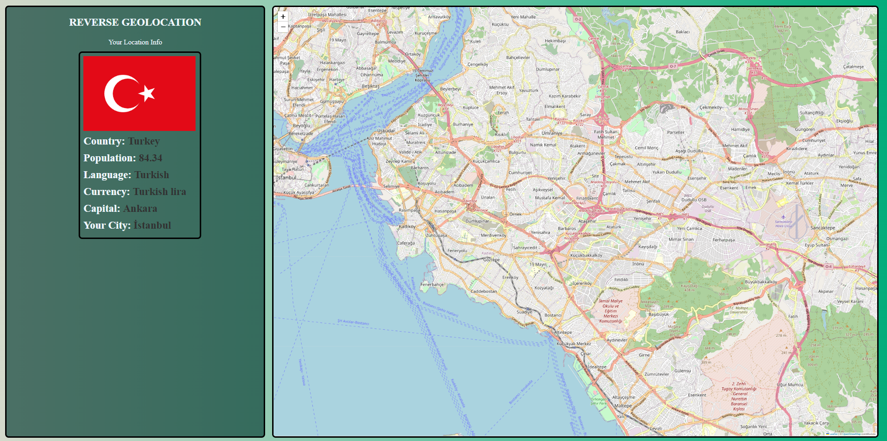

**_
JS AJAX Projects Series | 1 - Reverse Geolocation
_**

 

In this application, the user's location is displayed on the map using the Leaflet library using the Geolocation API embedded in the browser. Afterwards, the required location information is calculated from the lat lon information found with the reverse geocoding API, and the data of the country you are in is visualized by AJAX calls with the API that provides free country information.

 

  
   

 

The content of the Reverse Geolocation application;

- Fundemantel JS
- ES6 Class
- JS Events
- AJAX Calls
- JS Funtions
- async Functions
- Basic HTML
- Basic CSS
