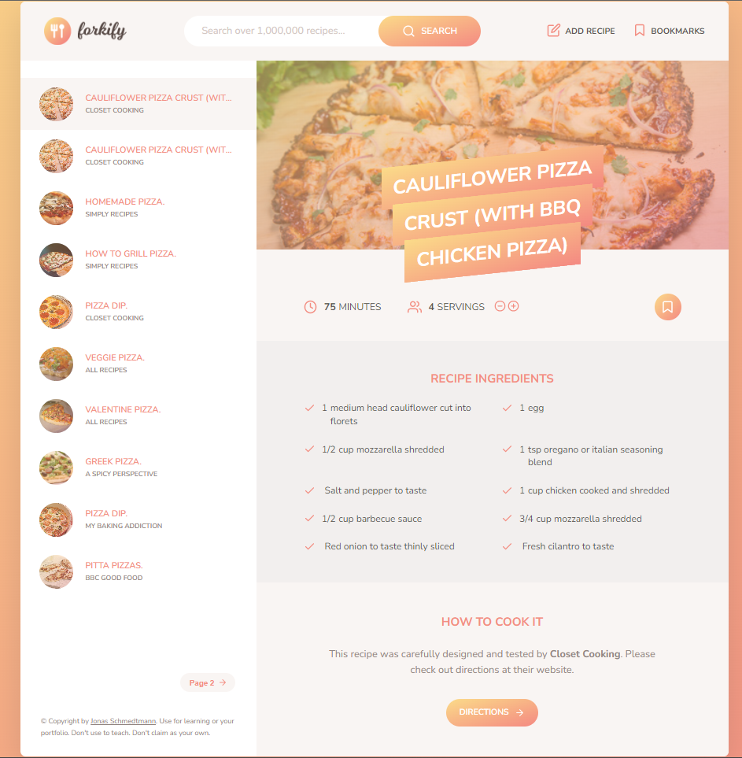

**_
JS AJAX Projects Series | 2 - Forkify 
_**

 

This app is 'a demo of [Forkify](https://forkify-v2.netlify.app/) app' by Jonas Schmedtmann. The app is basically a modern front-end application for searching, displaying and adding new recipes with AJAX calls.

 

  
   

 

The content of the Reverse Geolocation application;

- Fundemantel JS
- ES6 Class
- JS Events
- AJAX Calls
- JS Funtions
- async Functions
- Basic HTML
- Basic CSS

 

# To compile and run the code

1 - npm install  
2 - npm start
