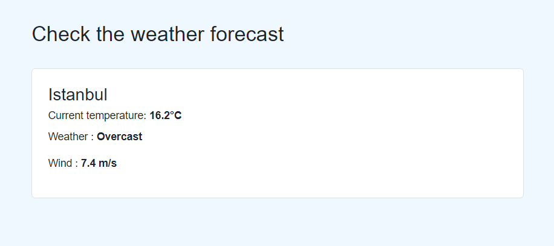

**_
JS AJAX Projects Series | 3 - Weather Forecast
_**

 
In this application, the weather forecast is presented instantly using the location of the user. While doing this, a simple interface was used. However, Code design is designed with MCV approach with modern programming techniques.
 
 

  
   

 

The content of the Weather Forecast application;

- Fundemantel JS
- ES6 Class
- JS Events
- AJAX Calls
- JS Funtions
- async Functions
- Basic HTML
- Basic CSS
