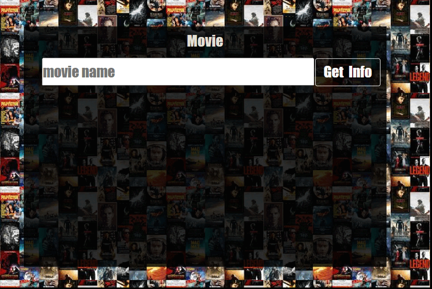

**_
JS AJAX Projects Series | 4 - Movie Archive
_**

 
In this application, it searches for any movie and gives information about the movie's and summary, trailer and release year.Data is accessed and visualized with API services related to AJAX calls.
 
 

  
   

 

The content of the Weather Forecast application;

- Fundemantel JS
- ES6 Class
- JS Events
- AJAX Calls
- JS Funtions
- async Functions
- Basic HTML
- Basic CSS
